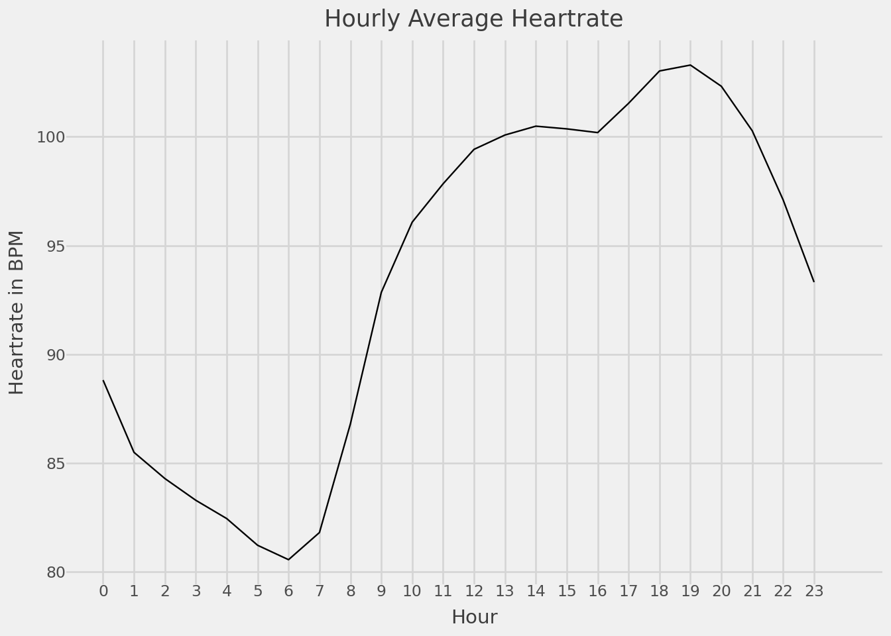
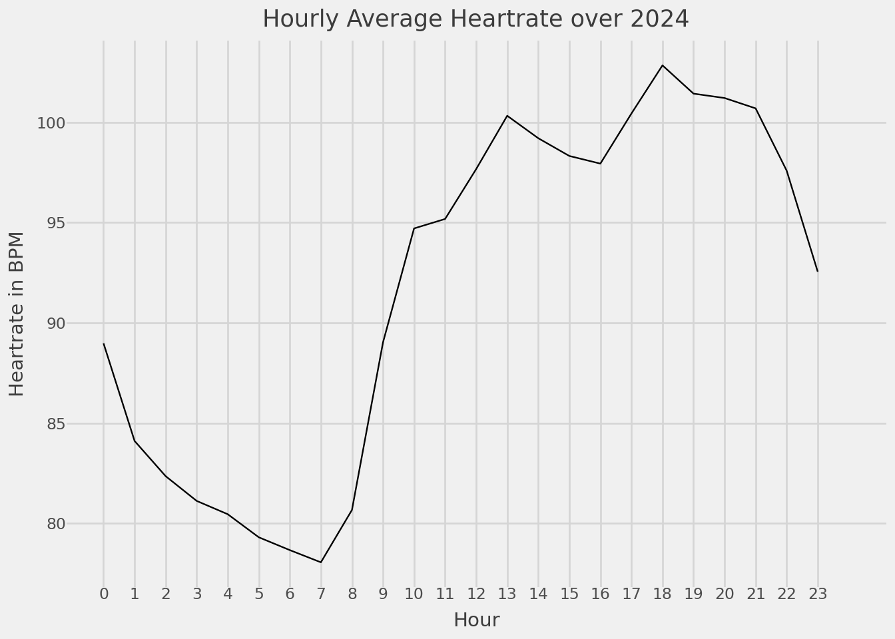

<!DOCTYPE html>
<html xmlns="http://www.w3.org/1999/xhtml" lang="en" xml:lang="en"><head>

<meta charset="utf-8">
<meta name="generator" content="quarto-1.7.23">

<meta name="viewport" content="width=device-width, initial-scale=1.0, user-scalable=yes">

<title>FitBit Heart Rate Data</title>

<link href="Heartrate_files/libs/quarto-html/tippy.css" rel="stylesheet">
<link href="Heartrate_files/libs/quarto-html/quarto-syntax-highlighting-226bd0f977fa82dfae4534cac220d79a.css" rel="stylesheet" id="quarto-text-highlighting-styles">

<link href="Heartrate_files/libs/bootstrap/bootstrap-icons.css" rel="stylesheet">
<link href="Heartrate_files/libs/bootstrap/bootstrap-bbaecfb7e2808c617f0c9be701779203.min.css" rel="stylesheet" append-hash="true" id="quarto-bootstrap" data-mode="light">

</head>

<body class="fullcontent quarto-light">

<main class="content" id="quarto-document-content">

<header id="title-block-header" class="quarto-title-block default">

<h1 class="title">FitBit Heart Rate Data</h1>

    
  
    
  

  

</header>

 Updated 2025-04-16 

Heartrate data is gathered roughly every 15 seconds by the FitBit Inspire 2, model FB418. It’s unknown whether this is a snapshot, or window average.

<section id="data" class="level2">
<h2 class="anchored" data-anchor-id="data">Data</h2>

Code

<pre class="sourceCode python code-with-copy"><code class="sourceCode python"># Don't use scientific notation
pd.options.display.float_format = '{:.0f}'.format

if os.path.exists("./data/heart_rate_combined.pkl"):
    df = pd.read_pickle("./data/heart_rate_combined.pkl")
else:
    file_list = glob.glob("./fitbit_data/heart_rate-*.json")
    data_frames = [pd.read_json(file) for file in file_list]
    df = pd.concat(data_frames)
    df['dateTime'] = df['dateTime'].dt.tz_localize("UTC")
    df['dateTime'] = df['dateTime'].dt.tz_convert("US/Central")
    df['year-month'] = df['dateTime'].dt.strftime("%Y-%m")
    df['year'] = df['dateTime'].dt.year
    df['month'] = df['dateTime'].dt.month
    df['day'] = df['dateTime'].dt.day
    df["bpm"] = [i["bpm"] for i in df["value"]]
    df = df.drop(columns=["value"])
    df.to_pickle("./data/heart_rate_combined.pkl")</code><button title="Copy to Clipboard" class="code-copy-button"><i class="bi"></i></button></pre>

Data is held as a series of daily json files, which are loaded and concatenated into a Pandas dataframe. The dataframe consists of the datetime in ISO format and bpm, with this analysis consisting of 9962774 datapoints. Other fields are created for ease of parsing later.

A sample of the data format is provided here:

Code

<pre class="sourceCode python code-with-copy"><code class="sourceCode python">print(df.tail(3))
#| include: false
# Prep daily data
daily = df.groupby(['year','month','day'])['bpm'].mean().reset_index()
daily['date'] = daily['year'].astype(str) + "-" +  daily['month'].astype(str) +  "-" + daily['day'].astype(str)
daily['date'] = pd.to_datetime(daily['date'])
daily = daily[['date','bpm']]</code><button title="Copy to Clipboard" class="code-copy-button"><i class="bi"></i></button></pre>

<pre><code>                       dateTime year-month  year  month  day  bpm
10680 2024-06-06 23:59:38-05:00    2024-06  2024      6    6   83
10681 2024-06-06 23:59:43-05:00    2024-06  2024      6    6   82
10682 2024-06-06 23:59:58-05:00    2024-06  2024      6    6   83</code></pre>

<!-- Possible dates to mark:   -->
<!-- 2022-12-02 - 2022-12-11 - Spain Vacation   -->
<!-- 2024-05-05 - 2024-05-13 - Italy Vacation   -->
<!-- 2024-06-01 - Ongoing - Move into new apart``ment   -->
<!-- 2024-12-07 - 2024-12-14 - Canada Vacation   -->
</section>
<section id="plotting" class="level2">
<h2 class="anchored" data-anchor-id="plotting">Plotting:</h2>

Code

<pre class="sourceCode python code-with-copy"><code class="sourceCode python">from plotnine import *
from mizani.breaks import date_breaks
(
    ggplot(daily, aes(x="date", y="bpm", group = 1))
    + geom_line()
    + scale_x_date(breaks=date_breaks(width="3 months"),date_minor_breaks="3 months")
    + geom_smooth(span=.3)
    + labs(x = "Date", 
      y = "Heartrate in BPM", 
      title = "Daily Average Heartrate")
    + theme(
            axis_text_x=element_text(rotation=25, hjust=1),
            panel_grid=element_line(color="grey"),
        )
)</code><button title="Copy to Clipboard" class="code-copy-button"><i class="bi"></i></button></pre>

<figure class="figure">

</figure>

Code

<pre class="sourceCode python code-with-copy"><code class="sourceCode python">import pandas as pd

df['hour'] = df['dateTime'].dt.hour

hourly = df.loc[df['year'] == 2024].groupby(['hour'], as_index= False)['bpm'].mean()
print(hourly.head())

(
    ggplot(hourly[['hour','bpm']], aes(x="hour", y="bpm", group = 1))
    + geom_line()
        + scale_x_continuous(limits=(0,24),breaks=range(0, 24, 1))
    + labs(x = "Hour", 
      y = "Heartrate in BPM", 
      title = "Hourly Average Heartrate over 2024")
        + theme_538()
)</code><button title="Copy to Clipboard" class="code-copy-button"><i class="bi"></i></button></pre>

<pre><code>   hour  bpm
0     0   87
1     1   83
2     2   83
3     3   82
4     4   82</code></pre>

<figure class="figure">

</figure>

Code

<pre class="sourceCode python code-with-copy"><code class="sourceCode python">this_year = df.loc[df['year'] == 2024]
print(this_year.head())

# (
#     ggplot(hourly[['hour','bpm']], aes(x="hour", y="bpm", group = 1))
#     + geom_line()
#       + scale_x_continuous(limits=(0,24),breaks=range(0, 24, 1))
#     + labs(x = "Hour", 
#       y = "Heartrate in BPM", 
#       title = "Hourly Average Heartrate over 2024")
#       + theme_538()
# )</code><button title="Copy to Clipboard" class="code-copy-button"><i class="bi"></i></button></pre>

<pre><code>                   dateTime year-month  year  month  day  bpm  hour
0 2024-10-02 00:00:00-05:00    2024-10  2024     10    2   88     0
1 2024-10-02 00:00:05-05:00    2024-10  2024     10    2   87     0
2 2024-10-02 00:00:20-05:00    2024-10  2024     10    2   87     0
3 2024-10-02 00:00:30-05:00    2024-10  2024     10    2   87     0
4 2024-10-02 00:00:35-05:00    2024-10  2024     10    2   88     0</code></pre>

</section>

</main>
<!-- /main column -->

 <!-- /content -->

</body></html>